# EngComic - E-Learning Platform 🚀

> Nền tảng học tiếng Anh sáng tạo kết hợp truyện tranh, gamification và AI-powered learning

[](https://reactjs.org/)
[](https://redux-toolkit.js.org/)
[](https://firebase.google.com/)

## 🎯 Highlights

**EngComic** là một full-stack web application độc đáo, biến việc học tiếng Anh thành trải nghiệm giải trí tương tác thông qua truyện tranh và game mechanics.

## 📸 Screenshots

### Trang chủ (Home Page)

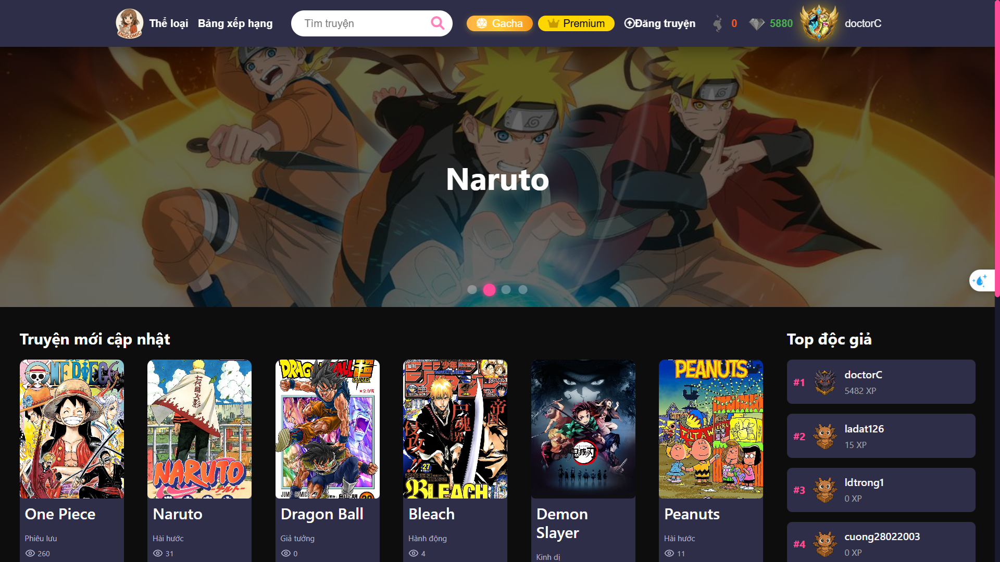
_Giao diện trang chủ với danh sách truyện tranh và các tính năng nổi bật_

### Công cụ OCR (OCR Tool)


_Công cụ nhận dạng văn bản từ ảnh chụp màn hình khi đọc truyện_

### Dịch thuật (Translator)

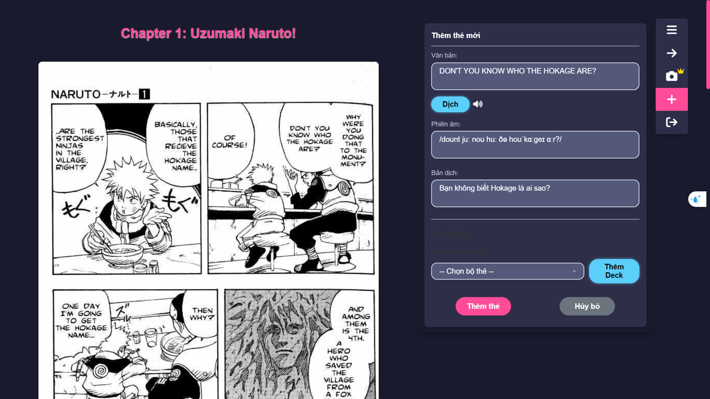
_Tính năng dịch văn bản tiếng Anh sang tiếng Việt với phiên âm IPA_

### Lưu vào bộ thẻ (Save to Deck)

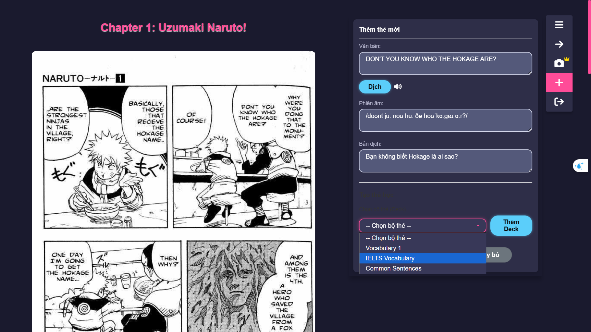
_Lưu từ vựng từ truyện vào bộ thẻ học tập cá nhân_

### Quản lý bộ thẻ (Deck Page)

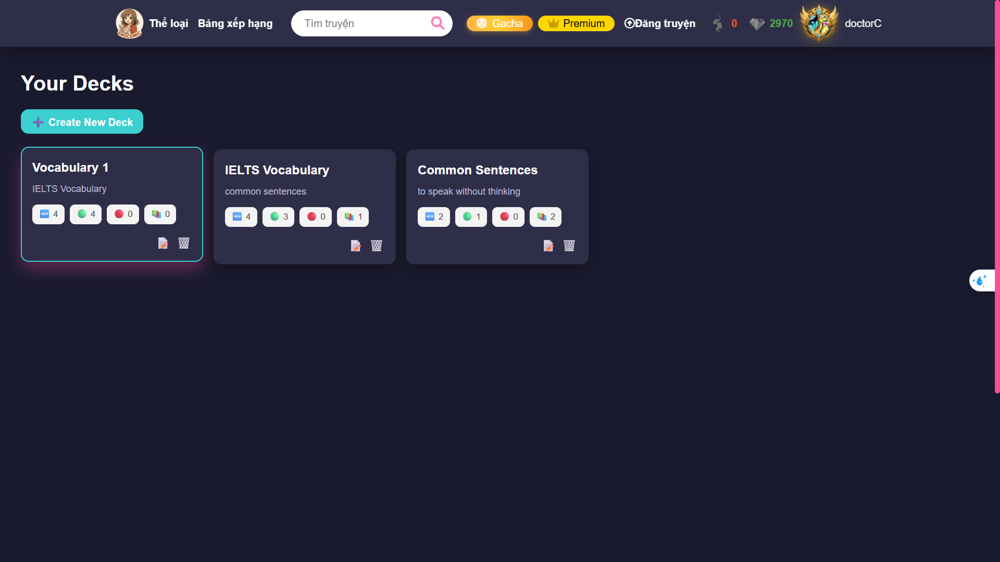
_Trang quản lý các bộ thẻ flashcard với thống kê tiến độ học_

### Học tập (Study Page)

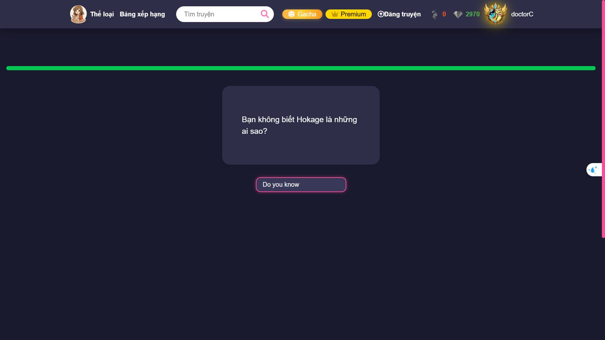
_Giao diện học flashcard với hệ thống lặp lại ngắt quãng_

### Học tập - Mặt sau thẻ (Study Page Flip)

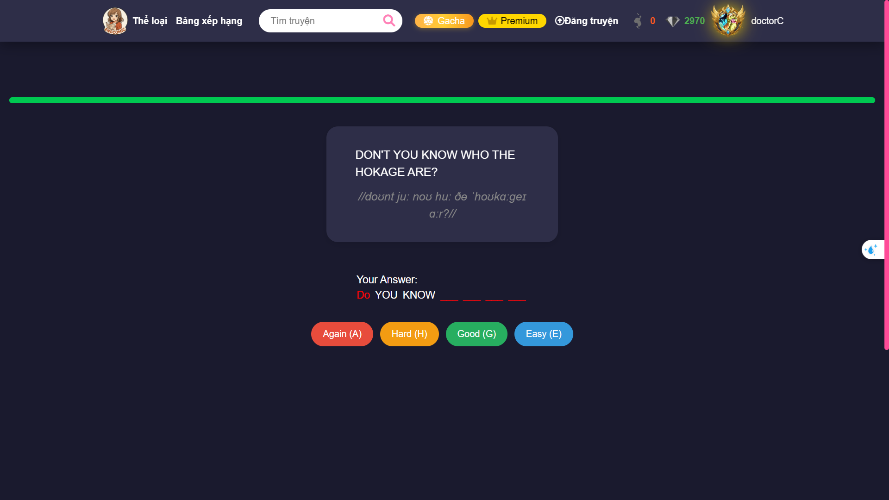
_Hiển thị đáp án và các tùy chọn đánh giá độ khó_

### Kết quả học tập (Result Page)

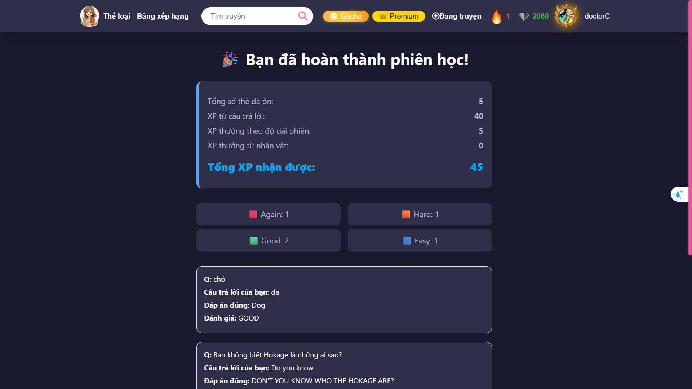
_Thống kê kết quả sau mỗi phiên học với điểm XP và streak_

### Bảng xếp hạng (Leaderboard)

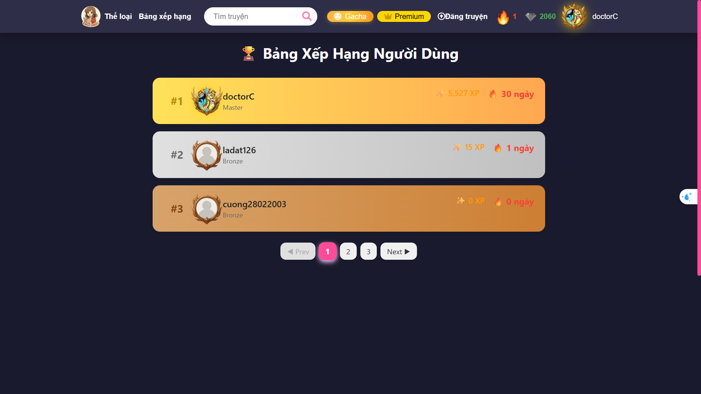
_Bảng xếp hạng người dùng theo XP và thành tích_

### Trang xếp hạng chi tiết (Ranking Page)

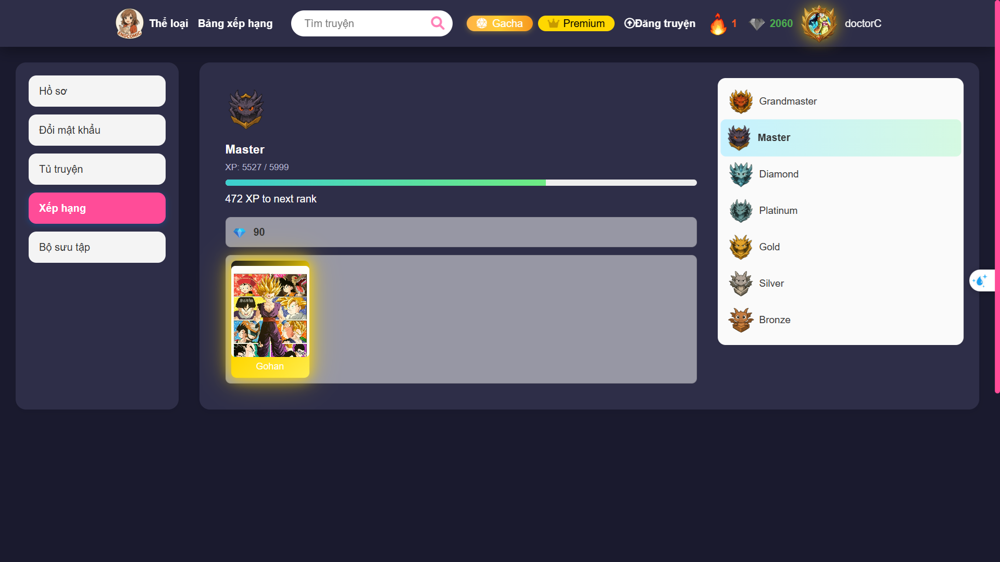
_Chi tiết thứ hạng và thống kê cá nhân_

### Hệ thống Gacha (Gacha Page)


_Hệ thống gacha để thu thập nhân vật với các độ hiếm khác nhau_

### Bộ sưu tập nhân vật (Character Collection)

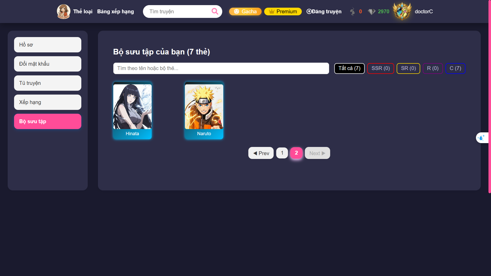
_Quản lý bộ sưu tập nhân vật đã sở hữu_

### Mini Game chiến đấu (Fighting Game)

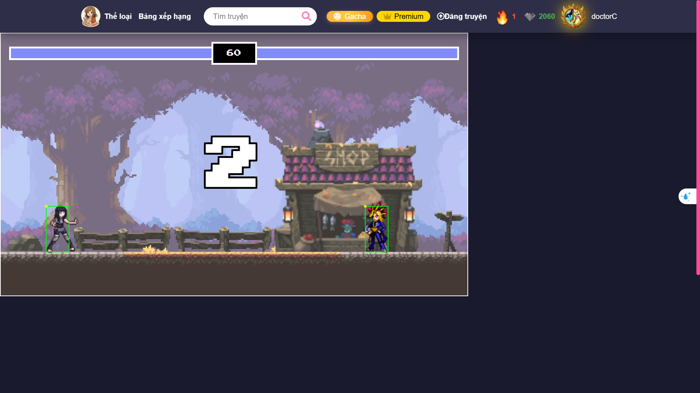
\*Mini game chiến đấu với sprite animation - **Đang phát triển\***

### 💡 Điểm nổi bật

- **🎮 Gamification System** - Gacha mechanics, deck building, và fighting game với sprite animation
- **📚 Content Management** - CMS hoàn chỉnh với CKEditor, upload hình ảnh qua Firebase Storage
- **🔐 JWT Authentication** - Bảo mật với access/refresh token và auto-renewal
- **🌐 Internationalization** - Hỗ trợ đa ngôn ngữ (vi/en) với Redux i18n
- **📊 Real-time Analytics** - XP system, streak tracking, leaderboard và user statistics
- **🎨 Modern UI/UX** - Responsive design với GSAP animations, Lottie effects, và Tailwind CSS
- **⚡ Performance Optimized** - Code splitting, lazy loading, và Redux Persist

## 🛠️ Tech Stack

**Frontend Architecture:**

- React 17 + React Router 6 (SPA with dynamic routing)
- Redux Toolkit + Redux Persist (centralized state management)
- SCSS/Sass + Tailwind CSS (modular styling system)

**Advanced Features:**

- GSAP + Lottie (complex animations & micro-interactions)
- Firebase Storage (cloud file management)
- Axios Interceptors (JWT refresh & error handling)
- Canvas API + HTML2Canvas (screenshot & image generation)
- Swiper.js (touch-enabled carousels)

**Development:**

- CKEditor5 (WYSIWYG content editor)
- React Toastify (notification system)
- date-fns (date utilities)
- Lodash (functional programming utilities)

## 🚀 Quick Start

```bash
# Clone & Install
git clone https://github.com/cuong28022003/EngComic_frontend.git
cd EngComic_frontend
npm install

# Configure environment
echo "REACT_APP_BASE_URL_API=http://localhost:8080/api" > .env

# Run development server
npm start
```

**Production Build:**

```bash
npm run build
npm run deploy  # Deploy to GitHub Pages
```

## 📦 Key Features

| Module              | Description                                                                       |
| ------------------- | --------------------------------------------------------------------------------- |
| **Comic Reader**    | Multi-chapter reading system với progress tracking, bookmarks, ratings & comments |
| **Gacha System**    | Probability-based character collection với rarity tiers & animations              |
| **Fighting Game**   | Canvas-based mini-game với sprite sheets & collision detection                    |
| **Deck Builder**    | Strategic card management system                                                  |
| **Leaderboard**     | Real-time ranking system với filtered views                                       |
| **Admin Dashboard** | Full CRUD operations cho comics, chapters, users & reports                        |
| **Payment System**  | Diamond topup integration                                                         |
| **User Profile**    | Customizable avatars với frames, stats tracking & achievement system              |

## 🏗️ Architecture Patterns

- **Component-Based Architecture** - Reusable components với props drilling prevention
- **Redux Slices** - Modular state management (auth, language, modal, messages)
- **Custom Hooks** - `useAdultMode`, business logic abstraction
- **Layout System** - MainLayout & AuthLayout cho consistent UI
- **API Layer** - Centralized API services với error handling
- **Route Protection** - PrivateRoute component cho authentication guards

## 🎓 Professional Skills Demonstrated

✅ **Frontend Development** - Modern React patterns, hooks, lifecycle management  
✅ **State Management** - Redux architecture, normalized state, optimistic updates  
✅ **API Integration** - RESTful APIs, JWT authentication, interceptors  
✅ **UI/UX Design** - Responsive layouts, animations, accessibility  
✅ **Performance** - Code optimization, lazy loading, bundle size reduction  
✅ **Cloud Services** - Firebase integration, storage management  
✅ **Version Control** - Git workflow, branch management  
✅ **Problem Solving** - Complex business logic implementation

## 📞 Contact

**GitHub:** [@cuong28022003](https://github.com/cuong28022003)  
**Repository:** [EngComic Frontend](https://github.com/cuong28022003/EngComic_frontend)

---

⭐ _Built with modern web technologies and best practices_
